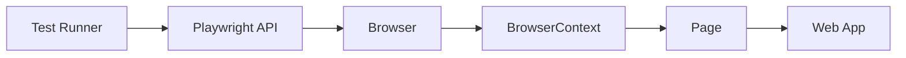
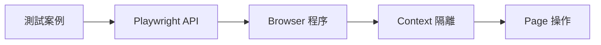

# Lab 00：Playwright 核心名詞導讀

目標：理解 Playwright 在 .NET C# 的核心元件與測試流程關係。  
預估時間：20 分鐘。

這份文件先建立共同語言，讓你在後續實作時知道每一段程式碼對應的責任。

## 一張圖先看整體

## `Playwright`

白話說明：  
`Playwright` 是一組 API，讓 C# 程式可以控制真實瀏覽器執行操作與驗證。

你在哪裡看到：

- 套件名稱：`Microsoft.Playwright`
- 程式入口：`Playwright.CreateAsync()`

常見問題：

- 誤解：「它只是 UI 測試工具。」  
  實際上也能做 API 驗證、截圖、追蹤（trace）與除錯流程輔助。

## `Browser`

白話說明：  
`Browser` 代表一個瀏覽器程序，例如 `Chromium`。

你在哪裡看到：

- `await playwright.Chromium.LaunchAsync(...)`

常見問題：

- 誤解：「每個測試都要開一個新 Browser。」  
  大多情況可以共用 Browser，改由 `Context` 做隔離，速度與資源使用更合理。

## `BrowserContext`

白話說明：  
`Context` 是隔離環境，類似無痕視窗。Cookie、Storage、Session 都在這層隔離。

你在哪裡看到：

- `await browser.NewContextAsync()`

常見問題：

- 誤解：「同一個 Browser 的測試會互相汙染。」  
  只要每個測試建立獨立 `Context`，就能避免狀態互相干擾。

## `Page`

白話說明：  
`Page` 就是一個分頁，你的點擊、輸入、斷言都在這層發生。

你在哪裡看到：

- `await context.NewPageAsync()`
- `await page.GotoAsync(...)`

常見問題：

- 誤解：「Page 等於 Browser。」  
  `Page` 是 `Context` 下的工作單位，不是整個瀏覽器程序。

## 自動等待（Auto-waiting）

白話說明：  
Playwright 在執行互動前會自動等待元素可操作，降低手動 `sleep` 的需求。

你在哪裡看到：

- `await page.GetByRole(...).ClickAsync()`

常見問題：

- 誤解：「一定要自己加很多固定等待時間。」  
  固定等待會拖慢測試且不穩定，應優先使用定位與條件等待。

## 一分鐘總結

## 本章學習重點回顧

完成本章後，你應該能把 `Browser`、`Context`、`Page` 對應到測試程式中的責任，並理解 Playwright 的作用是以可重現、自動化方式驗證 Web 行為，不是只做畫面點擊而已。
