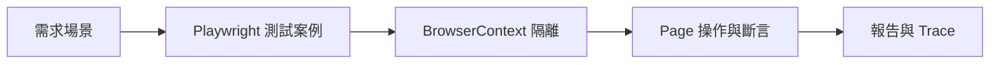
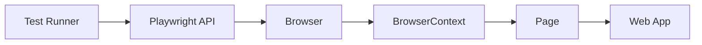
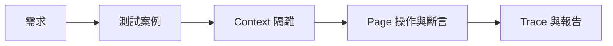

# Lab 00：Playwright 核心名詞導讀

目標：理解 Playwright 在 .NET C# 的核心元件與測試流程關係。  
預估時間：20 分鐘。

這份文件先建立共同語言，讓你在後續實作時知道每一段程式碼對應的責任。

## 你會做出什麼

做完本章後，你要能把「需求場景」一路對應到「測試案例、隔離、操作、除錯證據」。

### 1 Playwright 是什麼

`Playwright` 是瀏覽器自動化與端對端測試框架。  
你可以用程式驅動真實瀏覽器，模擬使用者操作，再用斷言確認行為是否符合預期。

### 2 主要用途

1. 驗證完整使用者流程：登入、查詢、下單、權限切換、表單送出。
2. 執行跨瀏覽器回歸：同一份測試同時驗證多個瀏覽器引擎。
3. 產出失敗證據：用 `trace`、截圖、報告回放失敗現場。
4. 驗證網路互動：攔截請求、mock 回應、確認前後端契約。

### 3 實務怎麼用

1. 用 `smoke` + `regression` 分層執行。
2. 優先覆蓋高風險商業流程。
3. 每個測試都隔離到獨立 `BrowserContext`。
4. 優先使用語意化定位器與 web-first assertion。
5. 測試失敗時先看 `trace`，再決定修測試或修產品。

## 一張圖看核心元件

## `Playwright`

白話說明：  
`Playwright` 是一組 API，讓 C# 程式可控制真實瀏覽器執行操作與驗證。

你在哪裡看到：

- 套件名稱：`Microsoft.Playwright`
- 常見程式入口：`Playwright.CreateAsync()`

常見問題：

- 誤解：「它只是 UI 點擊工具。」  
  實際上也能做 API 驗證、網路攔截、追蹤與除錯輔助。

## `Browser`

白話說明：  
`Browser` 代表一個瀏覽器程序，例如 `Chromium`。

你在哪裡看到：

- `await playwright.Chromium.LaunchAsync(...)`

常見問題：

- 誤解：「每個測試都要開一個新 `Browser`。」  
  多數情境可共用 `Browser`，改用 `BrowserContext` 隔離狀態。

## `BrowserContext`

白話說明：  
`BrowserContext` 是隔離環境，類似無痕視窗。Cookie、Storage、Session 都在這層分離。

你在哪裡看到：

- `await browser.NewContextAsync()`

常見問題：

- 誤解：「同一個 `Browser` 一定會互相汙染。」  
  只要每個測試使用獨立 `BrowserContext`，就能避免案例互相干擾。

## `Page`

白話說明：  
`Page` 是瀏覽器分頁，點擊、輸入、斷言都在這層發生。

你在哪裡看到：

- `await context.NewPageAsync()`
- `await page.GotoAsync(...)`

常見問題：

- 誤解：「`Page` 等於整個瀏覽器。」  
  `Page` 是 `BrowserContext` 下的工作單位，不是整個 `Browser` 程序。

## 自動等待（Auto-waiting）

白話說明：  
Playwright 在執行互動前會自動等待元素可操作，降低手動 `sleep` 的需求。

你在哪裡看到：

- `await page.GetByRole(...).ClickAsync()`

常見問題：

- 誤解：「一定要自己加很多固定等待時間。」  
  固定等待會拖慢測試且不穩定，應優先使用定位與條件等待。

## 語意化定位器（Resilient Locators）

白話說明：  
定位器不是只為了「找得到元素」，而是為了「長期可維護」。優先使用使用者視角可理解的定位方式。

你在哪裡看到：

- `GetByRole(...)`
- `GetByLabel(...)`
- `GetByTestId(...)`

常見問題：

- 誤解：「CSS selector 最直覺，所以最穩。」  
  在 UI 重構時，語意化定位器通常比純樣式路徑更耐變動。

## 一分鐘總結

## 本章學習重點回顧

完成本章後，你應該能做到：

- 用一句話說清楚 `Playwright` 的定位與主要用途。
- 把 `Browser`、`BrowserContext`、`Page` 對應到實際程式責任。
- 解釋為什麼隔離、語意化定位與自動等待能降低 flaky。
- 知道測試失敗時，應先從 `trace` 與報告找證據再修正。
