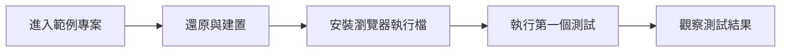
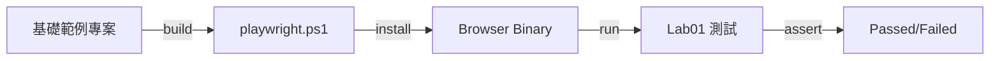

# Lab 01：執行第一個 C# Playwright 測試

目標：使用課程提供的基礎範例程式，成功跑通第一個 Playwright 測試。  
預估時間：35 分鐘。

## 你會做出什麼



完成後你會確認課程範例專案可在本機穩定執行，後續 Labs 可直接在同一專案延伸。

## Step 1：進入課程範例專案

1. 在 repo 根目錄執行：

```powershell
cd .\course-assets\playwright-dotnet-nunit\PlaywrightCourse.Tests
```

2. 還原套件並建置：

```powershell
dotnet restore
dotnet build
```

說明：課程提供的是可直接跑的基礎模板，先確認你本機環境能建置，才能避免後續練習被環境問題卡住。

## Step 2：安裝瀏覽器執行檔

1. 在專案目錄執行：

```powershell
pwsh bin/Debug/net9.0/playwright.ps1 install
```

2. 若你的環境沒有 `pwsh`，可改用：

```powershell
powershell -ExecutionPolicy Bypass -File .\bin\Debug\net9.0\playwright.ps1 install
```

說明：NuGet 套件只提供 API，真正驅動瀏覽器的二進位檔要另外安裝，否則測試執行時會找不到 browser。

## Step 3：執行第一個測試

1. 執行：

```powershell
dotnet test --filter "FullyQualifiedName~Lab01_SmokeTests"
```

2. 成功條件：

- 測試結果顯示 `Passed`
- 無 `browser executable doesn't exist` 錯誤

說明：如果此步成功，代表你的專案、套件、瀏覽器執行檔與測試框架都已對齊。

## Step 4：閱讀基礎範例程式

1. 打開 `Tests/Lab01_SmokeTests.cs`。
2. 對照三個核心物件：
   - `Page`
   - `Locator`
   - `Expect(...)`

說明：先看懂基礎範例，後續每個 Lab 只是在這個骨架上增加複雜度。

## 練習題

### 練習 1：改用 `GetByRole` 驗證首頁主標題

沿用本 Lab 的測試，不需刪除先前設定。  
請新增一段斷言，使用 `GetByRole(AriaRole.Heading)` 驗證頁面包含 `Playwright` 主標題。

確認方式：

1. `dotnet test` 仍為 `Passed`
2. 將預期文字故意改錯時，測試要能正確失敗

### 練習 2：改為 `Headed` 模式觀察流程

沿用同一份測試程式，覆寫 `ContextOptions()` 設定 headed 模式。  
不需清除其他設定。

確認方式：

1. 執行測試時會出現瀏覽器視窗
2. 測試結束後依然回報 `Passed`

## 完成檢查

- 你知道如何使用課程基礎範例專案快速起跑。
- 你能完成瀏覽器執行檔安裝並排除常見錯誤。
- 你能閱讀並執行第一個 C# Playwright 測試案例。
- 你知道 `Headless` 與 `Headed` 的用途差異。

## 常見錯誤

- `browser executable doesn't exist`：尚未執行 `playwright.ps1 install`，或 TFM 路徑不一致。
- `pwsh is not recognized`：系統未安裝 PowerShell 7，可改用 Windows PowerShell 執行腳本。
- `Timeout ... exceeded`：目標網站回應慢或網路受限，先確認 URL 可從本機開啟。

## 本 Lab 的學習重點回顧

這個 Lab 建立的是「.NET 測試執行流程」：



整個流程的意思是：

1. 先使用已準備好的課程測試專案。
2. 建置後產生 Playwright 安裝腳本。
3. 安裝瀏覽器執行檔讓測試可啟動。
4. 執行 `Lab01` 案例驗證環境與流程。
5. 取得可追蹤的測試成功或失敗結果。

做完後你要理解：

- Playwright 在 C# 的核心價值是「可重現的使用者流程驗證」。
- 穩定測試依賴 `Context` 隔離與正確定位策略，而不是大量固定等待。
- 這套流程可直接帶入 CI，作為發版前的自動品質關卡。
