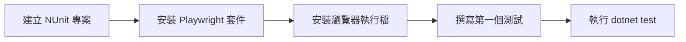
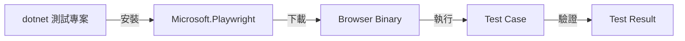

# Lab 01：建立第一個 C# Playwright 測試

目標：從零建立 .NET C# Playwright 測試專案，並成功執行第一個測試案例。  
預估時間：35 分鐘。

## 你會做出什麼



完成後你會有一個可在本機與 CI 直接執行的 E2E 測試基礎專案。

## Step 1：建立測試專案

1. 在 repo 根目錄執行：

```powershell
dotnet new nunit -n PlaywrightDemo.Tests
```

2. 進入專案資料夾：

```powershell
cd .\PlaywrightDemo.Tests
```

3. 確認專案可編譯：

```powershell
dotnet build
```

說明：先確認基本專案能編譯，可以把環境問題和測試程式問題分開處理，避免後續除錯混在一起。

## Step 2：安裝 Playwright 套件

1. 安裝 `Microsoft.Playwright`：

```powershell
dotnet add package Microsoft.Playwright
```

2. 再次編譯專案：

```powershell
dotnet build
```

說明：`dotnet build` 會產生 Playwright 安裝瀏覽器所需的腳本，這是下一步的前置條件。

## Step 3：安裝瀏覽器執行檔

1. 在專案目錄執行（`net8.0` 請依你的 Target Framework 調整）：

```powershell
pwsh bin/Debug/net8.0/playwright.ps1 install
```

2. 若你的環境沒有 `pwsh`，可改用：

```powershell
powershell -ExecutionPolicy Bypass -File .\bin\Debug\net8.0\playwright.ps1 install
```

說明：NuGet 套件只提供 API，真正驅動瀏覽器的二進位檔要另外安裝，否則測試執行時會找不到 browser。

## Step 4：撰寫第一個測試

1. 將 `UnitTest1.cs` 改成以下內容：

```csharp
using Microsoft.Playwright;
using NUnit.Framework;
using System.Threading.Tasks;

namespace PlaywrightDemo.Tests;

public class FirstPlaywrightTest
{
    [Test]
    public async Task Homepage_ShouldContainPlaywrightText()
    {
        using var playwright = await Playwright.CreateAsync();
        await using var browser = await playwright.Chromium.LaunchAsync(new BrowserTypeLaunchOptions
        {
            Headless = true
        });

        var context = await browser.NewContextAsync();
        var page = await context.NewPageAsync();

        await page.GotoAsync("https://playwright.dev/");
        var title = await page.TitleAsync();

        Assert.That(title, Does.Contain("Playwright"));
    }
}
```

說明：第一個案例只驗證標題是否包含 `Playwright`，目的是先打通完整流程，而不是一次引入太多複雜斷言。

## Step 5：執行測試

1. 執行：

```powershell
dotnet test
```

2. 成功條件：

- 測試結果顯示 `Passed`
- 無 `browser executable doesn't exist` 錯誤

說明：如果此步成功，代表你的專案、套件、瀏覽器執行檔與測試框架都已對齊。

## 練習題

### 練習 1：改用 `GetByRole` 驗證首頁主標題

沿用本 Lab 的測試，不需刪除先前設定。  
請新增一段斷言，使用 `GetByRole(AriaRole.Heading)` 驗證頁面有包含 `Playwright` 的標題文字。

確認方式：

1. `dotnet test` 仍為 `Passed`
2. 將預期文字故意改錯時，測試要能正確失敗

### 練習 2：改為 `Headed` 模式觀察流程

沿用同一份測試程式，僅把 `Headless = true` 改為 `Headless = false`。  
不需清除其他設定。

確認方式：

1. 執行測試時會出現瀏覽器視窗
2. 測試結束後依然回報 `Passed`

## 完成檢查

- 你知道如何在 .NET 專案安裝 `Microsoft.Playwright`。
- 你能完成瀏覽器執行檔安裝並排除常見錯誤。
- 你能撰寫與執行第一個 C# Playwright 測試案例。
- 你知道 `Headless` 與 `Headed` 的用途差異。

## 常見錯誤

- `browser executable doesn't exist`：尚未執行 `playwright.ps1 install`，或 TFM 路徑不一致。
- `pwsh is not recognized`：系統未安裝 PowerShell 7，可改用 Windows PowerShell 執行腳本。
- `Timeout ... exceeded`：目標網站回應慢或網路受限，先確認 URL 可從本機開啟。

## 本 Lab 的學習重點回顧

這個 Lab 建立的是「.NET 測試執行流程」：



整個流程的意思是：

1. 先有可編譯的 `.NET` 測試專案。
2. 透過套件取得 Playwright API。
3. 安裝瀏覽器執行檔，讓 API 有可控制目標。
4. 在測試案例裡操作 `Page` 並做斷言。
5. 由 `dotnet test` 回傳可追蹤的成功或失敗結果。

做完後你要理解：

- Playwright 在 C# 的核心價值是「可重現的使用者流程驗證」。
- 穩定測試依賴 `Context` 隔離與正確定位策略，而不是大量固定等待。
- 這套流程可直接帶入 CI，作為發版前的自動品質關卡。
