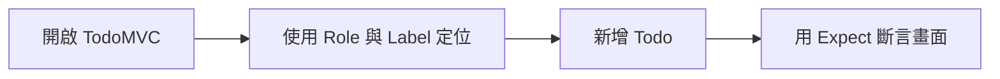
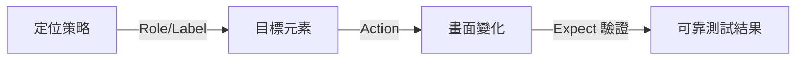

# Lab 02：定位策略與斷言

目標：學會用穩定定位策略與可等待斷言，降低測試不穩定問題。  
預估時間：35 分鐘。

## 你會做出什麼



## Step 1：使用範例專案執行 Lab 02 測試

1. 進入專案資料夾：

```powershell
cd .\course-assets\playwright-dotnet-nunit\PlaywrightCourse.Tests
```

2. 安裝 browser binary：

```powershell
dotnet build
pwsh bin/Debug/net9.0/playwright.ps1 install
```

3. 執行單一測試檔：

```powershell
dotnet test --filter "FullyQualifiedName~Lab02_LocatorsAndAssertionsTests"
```

說明：先只跑單一 Lab，能把問題範圍縮小到你當前練習內容。

## Step 2：觀察定位策略

1. 打開 `Tests/Lab02_LocatorsAndAssertionsTests.cs`。
2. 觀察下列定位方式：
   - `GetByRole`
   - `GetByPlaceholder`
   - `GetByTestId`
3. 觀察斷言方式：
   - `Expect(locator).ToHaveCountAsync`
   - `Expect(locator).ToContainTextAsync`
   - `Expect(locator).ToBeCheckedAsync`

說明：優先用語意定位（Role/Label）比 CSS 路徑更抗 UI 變動。

## Step 3：完成練習題

1. 在同一檔案新增一個測試：
   - 新增三筆 Todo
   - 勾選第二筆
   - 驗證第一筆仍是未完成狀態
2. 測試名稱使用：
   - `Should_KeepOtherItemsActive_When_OnlyOneItemCompleted`

說明：練習題要求你一次使用多個定位與多個斷言，這是實務中最常見的基本型態。

## 練習題

### 練習 1：改成 `GetByTestId` 寫法

沿用本 Lab，不需清除任何設定。  
把其中一段 `GetByRole` 改寫成 `GetByTestId`，比較可讀性與穩定性差異。

確認方式：

1. 測試仍為 `Passed`
2. 你能說出這兩種定位策略的取捨

## 完成檢查

- 你知道為什麼不建議用過度依賴 CSS 階層的定位方式。
- 你知道 `Expect` 會等待條件成立，不等於立即硬比對。
- 你能在同一案例中同時驗證元素數量、文字與狀態。

## 本 Lab 的學習重點回顧

這個 Lab 建立的是「穩定定位 + 可等待斷言」：



做完後你要理解：

- 定位策略是測試穩定性的第一層。
- 斷言策略是測試可維護性的第二層。
- 兩者一起做對，才能降低 flaky test。
