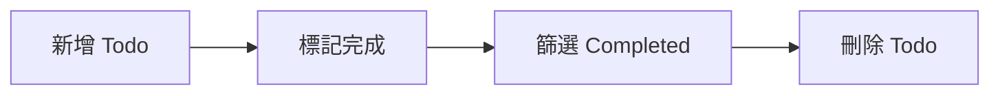

# Lab 03：TodoMVC CRUD 實戰

目標：完成新增、完成、刪除 Todo 的完整 E2E 流程。  
預估時間：45 分鐘。

## 你會做出什麼



## Step 1：執行現有 CRUD 範例

1. 確認你在 `PlaywrightCourse.Tests` 專案目錄。
2. 執行：

```powershell
dotnet test --filter "FullyQualifiedName~Lab03_TodoCrudTests"
```

說明：這個測試會跑過完整操作路徑，是你最接近真實使用者行為的第一個案例。

## Step 2：閱讀案例的行為分段

1. 打開 `Tests/Lab03_TodoCrudTests.cs`。
2. 將流程拆成四段：
   - Arrange：導頁並建立初始資料
   - Act：操作 UI
   - Assert：驗證狀態變化
   - Cleanup：此例由測試隔離機制自動處理

說明：把流程寫成可讀分段，比「一次寫到底」更容易維護與 code review。

## Step 3：新增一個負向驗證

1. 新增測試：
   - 當新增空白 Todo（只輸入空白字元）時，不應新增項目
2. 建議名稱：
   - `Should_NotCreateTodo_When_InputIsWhitespace`

說明：有正向案例不夠，負向案例是防止回歸錯誤的關鍵。

## 練習題

### 練習 1：驗證 `items left` 計數

沿用本 Lab 既有案例設定，不需重建資料來源。  
新增兩筆 Todo，完成其中一筆，驗證 `items left` 文字顯示正確。

確認方式：

1. `dotnet test` 為 `Passed`
2. 故意把期望值改錯，測試應明確失敗

## 完成檢查

- 你能寫出一條完整的 CRUD E2E 測試。
- 你知道如何增加負向驗證防止誤判。
- 你能把測試拆成可維護的段落。

## 本 Lab 的學習重點回顧


做完後你要理解：

- E2E 的價值不是點按鈕，而是驗證完整業務路徑。
- CRUD 案例是後續支付、訂單、審批等流程測試的模板。
