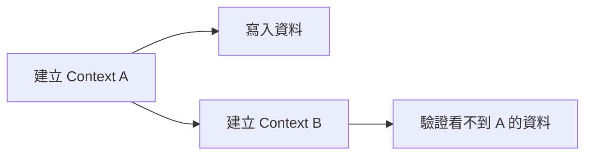
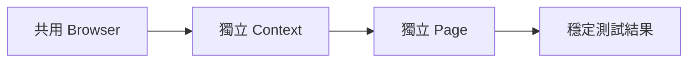

# Lab 04：隔離、Hook 與測試資料

目標：理解 `BrowserContext` 隔離與 Hook 的用途，避免測試互相污染。  
預估時間：40 分鐘。

## 你會做出什麼



## Step 1：執行隔離測試

1. 執行：

```powershell
dotnet test --filter "FullyQualifiedName~Lab04_ContextIsolationTests"
```

2. 觀察測試目的：
   - 同一個 Browser 下，不同 Context 互不共享狀態。

說明：如果隔離做錯，測試會變成「偶爾過、偶爾不過」，在 CI 上最難追。

## Step 2：加入初始化 Hook

1. 在測試類別增加 `[SetUp]`。
2. 把重複的 `GotoAsync` 或初始化資料移到 Hook。
3. 再執行一次測試確認結果不變。

說明：Hook 的目標是減少重複與確保每次測試起跑點一致。

## Step 3：建立可重用測試資料

1. 建立一個 `static` helper 回傳 Todo 清單。
2. 讓兩個測試共用同一份資料來源。

說明：把資料集中管理可以減少硬編碼字串散落，降低未來改版成本。

## 練習題

### 練習 1：驗證跨測試不殘留

沿用本 Lab，不需保留上一題操作結果。  
新增兩個測試：第一個新增 Todo，第二個直接驗證初始空狀態。

確認方式：

1. 不論測試順序都應 `Passed`
2. 平行執行時結果仍穩定

## 完成檢查

- 你知道 `Browser` 與 `BrowserContext` 的責任差異。
- 你能用 Hook 統一每個案例的前置狀態。
- 你能寫出不依賴執行順序的測試。

## 本 Lab 的學習重點回顧



做完後你要理解：

- 隔離是可平行、可預測測試的核心。
- Hook 與測試資料設計決定日後維護成本。
