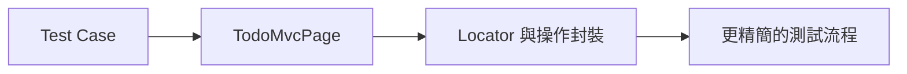
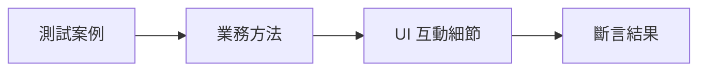

# Lab 05：Page Object Model 重構

目標：把重複的 UI 操作抽成 `Page Object`，提升可讀性與可維護性。  
預估時間：45 分鐘。

## 你會做出什麼



## Step 1：執行 POM 範例測試

1. 執行：

```powershell
dotnet test --filter "FullyQualifiedName~Lab05_PageObjectTests"
```

2. 打開 `Pages/TodoMvcPage.cs` 與 `Tests/Lab05_PageObjectTests.cs` 對照閱讀。

說明：先看「封裝前後」的差異，才能理解 POM 在大型專案的必要性。

## Step 2：新增一個領域方法

1. 在 `TodoMvcPage` 觀察既有 `ClearCompletedAsync()` 的實作。
2. 新增 `GetItemsLeftTextAsync()` 方法回傳頁面 `items left` 文字。
3. 在測試裡呼叫該方法做斷言。

說明：把業務語意寫在 Page Object，測試會更像需求描述而不是工具腳本。

## Step 3：避免過度封裝

1. 不要把每一行 locator 都獨立成 public 方法。
2. 只封裝「可重複使用的業務動作」。

說明：過度封裝會讓維護變難，POM 的重點是抽象出穩定語意，不是抽象所有程式碼。

## 練習題

### 練習 1：新增 `MarkAllCompletedAsync`

沿用本 Lab 既有設定，不需刪除之前方法。  
實作 `MarkAllCompletedAsync`，並新增對應測試。

確認方式：

1. 既有測試不受影響
2. 新測試可穩定通過

## 完成檢查

- 你能分辨哪些邏輯該放在 Page Object。
- 你能讓測試名稱與步驟對齊業務語意。
- 你知道如何在可讀性與彈性間取平衡。

## 本 Lab 的學習重點回顧



做完後你要理解：

- POM 是為了控制維護成本，不是為了設計模式本身。
- 頁面變動時，集中修改封裝層能降低回歸風險。
