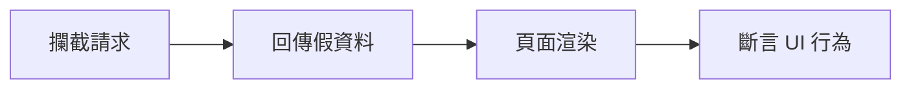
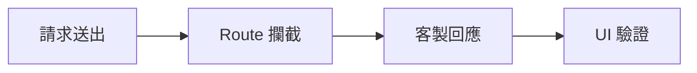

# Lab 06：網路攔截與 API 驗證

目標：學會在 E2E 中控制網路回應，驗證前端在不同後端情境的行為。  
預估時間：40 分鐘。

## 你會做出什麼



## Step 1：加入網路攔截

1. 執行課程範例測試：

```powershell
dotnet test --filter "FullyQualifiedName~Lab06_NetworkAndApiTests"
```

2. 打開 `Tests/Lab06_NetworkAndApiTests.cs`，觀察 `Context.RouteAsync(...)` 的路由設定。
2. 攔截指定 API 並回傳固定 JSON。

說明：在外部服務不穩或資料不可控時，攔截能讓測試可重現。

## Step 2：驗證成功回應情境

1. 觀察 `Should_MockSuccessResponse_WithRoute`，它模擬回傳 `200`。
2. 斷言畫面顯示預期資料。

說明：先有成功情境，才能對照失敗情境差異。

## Step 3：驗證失敗回應情境

1. 觀察 `Should_ShowErrorMessage_When_ApiReturns500`，同一條 API 改回傳 `500`。
2. 斷言畫面出現錯誤提示。

說明：錯誤處理是最常漏測區域，這一步是為了補足風險。

## 練習題

### 練習 1：模擬慢速回應

沿用本 Lab 設定，保留既有攔截邏輯。  
新增一個延遲回應情境，驗證 loading 狀態會顯示與消失。

確認方式：

1. 能穩定重現 loading 過程
2. 測試完成後不殘留攔截設定到其他案例

## 完成檢查

- 你知道何時該用真實 API，何時該用攔截。
- 你能測成功、失敗與延遲三種回應情境。
- 你能寫出不依賴外部服務穩定度的測試。

## 本 Lab 的學習重點回顧



做完後你要理解：

- 網路控制能力是讓 E2E 變可預測的關鍵。
- 你可以用少量案例覆蓋多種後端狀態，提升測試價值。
