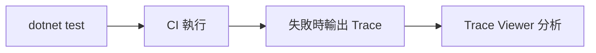
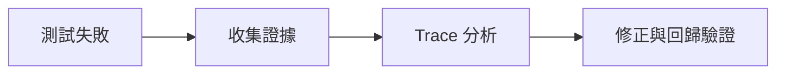

# Lab 07：CI、報告與 Trace 除錯

目標：把 Playwright 測試接進 CI，並能用 Trace 快速定位失敗點。  
預估時間：35 分鐘。

## 你會做出什麼

## Step 1：在本機輸出 Trace

1. 於測試中設定：
   - 開始追蹤 `Context.Tracing.StartAsync(...)`
   - 測試後輸出 `trace.zip`
2. 執行測試後確認檔案存在。

說明：Trace 可還原步驟、DOM 快照與網路資訊，除錯效率遠高於只看 log。

## Step 2：建立 CI 最小流程

1. 參考範例檔：`course-assets/playwright-dotnet-nunit/ci/github-actions-playwright-dotnet.yml`。
2. 建立 CI 步驟：
   - 還原套件
   - 建置
   - 安裝 Playwright browser binary
   - 執行 `dotnet test` 並輸出 `trx` 結果
3. 使用 `actions/upload-artifact` 上傳 `TestResults`。
4. 失敗時上傳 `trace.zip`（若有啟用 trace 產出）。

說明：只要 CI 能重現失敗，你就不需要靠「本機看起來沒問題」判斷品質。

## Step 3：制定失敗排查順序

1. 先看 assertion 訊息。
2. 再看 Trace 中最後一個失敗互動步驟。
3. 最後比對網路回應與頁面狀態。

說明：固定排查順序能減少多人協作時的除錯歧異。

## 練習題

### 練習 1：製造一次可預期失敗並排查

沿用本 Lab，不需清除既有 CI 設定。  
故意把一段預期文字改錯，執行後用 Trace 找到失敗步驟並修回。

確認方式：

1. 你能指出確切失敗步驟
2. 修正後測試重新通過

## 完成檢查

- 你能在本機與 CI 取得可分析的測試證據。
- 你知道如何用 Trace 進行快速除錯。
- 你能建立團隊共用的排查流程。

## 本 Lab 的學習重點回顧

做完後你要理解：

- 自動化測試不是只有「跑」，而是要能「快速修」。
- Trace 與 CI 是把測試從個人能力升級到團隊能力的核心。
