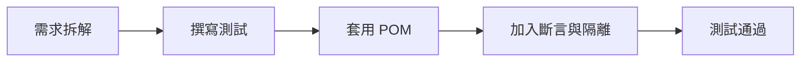
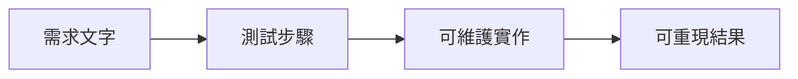

# Lab 08：期末任務

目標：獨立完成一條可維護的 TodoMVC 端對端測試，並符合課程驗收標準。  
預估時間：60 分鐘。

## 你會做出什麼



## 任務說明

請完成 `Challenges/Lab08_FinalChallengeTests.cs`，實作以下驗收流程：

1. 新增三筆 Todo。
2. 完成其中一筆。
3. 切換 `Active` / `Completed` 篩選驗證數量。
4. 刪除已完成項目。
5. 驗證 `items left` 顯示正確。

## Step 1：啟用挑戰測試

1. 打開 `Lab08_FinalChallengeTests.cs`。
2. 移除 `[Ignore(...)]`。
3. 補齊測試內容後執行：

```powershell
dotnet test --filter "FullyQualifiedName~Lab08_FinalChallengeTests"
```

說明：先只跑挑戰題，避免被其他案例結果干擾。

## Step 2：套用你在前面 Lab 學到的規則

1. 優先使用語意定位（Role、Label、TestId）。
2. 斷言使用 `Expect`，避免固定等待。
3. 如有重複行為，抽到 `TodoMvcPage`。

說明：期末任務不是比誰寫得快，而是驗證你能否寫出可長期維護的測試。

## Step 3：完成自我驗收

1. 至少連續執行三次都 `Passed`。
2. 測試名稱清楚描述業務結果。
3. 程式可讓其他人不看你口頭說明就能理解。

說明：能穩定重跑且容易理解，才是可交付的測試。

## 完成檢查

- 你能獨立從需求寫到可執行測試。
- 你能把定位、斷言、隔離與封裝一起用在同一案例。
- 你有能力把此模式移植到真實專案頁面流程。

## 本 Lab 的學習重點回顧



做完後你要理解：

- 真正的入門完成標準是「可獨立交付」，不是「看懂範例」。
